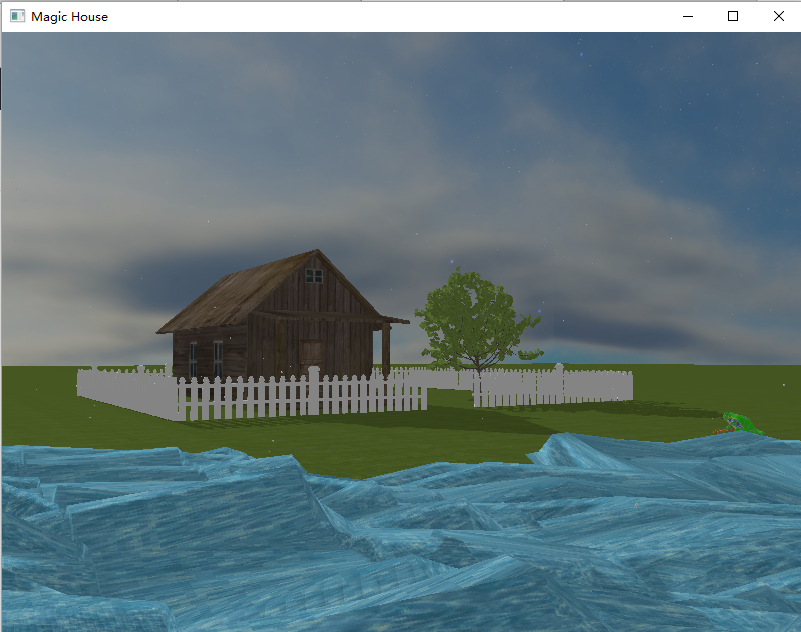
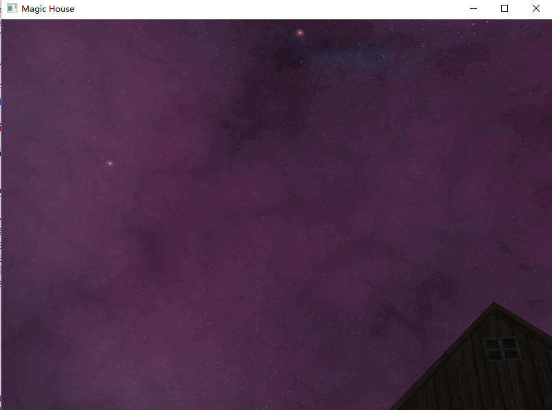

实现功能列表(Basic与Bonus)
==========================

Basic
-----

-   Simple lighting and shading(phong和光照贴图)

Bonus
-----

-   Complex Ligting(Gamma矫正，HDR，昼夜变换)

对实现的功能点做简单介绍(Bonus主要介绍实现原理)，加结果截图
===========================================================

Basic
-----

### 光源

光源可选择点光源或平行光源，在`Light`类中进行配置。

在mesh.fs中创建了一个光照属性结构体，mesh.fs是用于渲染所有光照物体的片段着色器。

~~~~~~~~~~~~~~~~~~~~~~~~~~~~~~~~~~~~~~~~~~~~~~~~~~~~~~~~~~~~~~~~~~~~~~~~~~~~~~~~
struct Light {
    vec3 position;
    vec3 direction;
    vec3 ambient;
    vec3 diffuse;
    vec3 specular;
};

uniform Light light;
~~~~~~~~~~~~~~~~~~~~~~~~~~~~~~~~~~~~~~~~~~~~~~~~~~~~~~~~~~~~~~~~~~~~~~~~~~~~~~~~

将Ligth类和光照属性结构体均独立出来可以便于添加不同光源，便于修改不同光属性，以及便于实现昼夜变换，随着全局时间变换太阳光方向等模拟真实太阳升起落下等等。

目前场景仅一个太阳光源为平行光。

### 物体材质

不同物体受光材质不同，其漫反射，环境反射和镜面反射度均可能不相同，同一物体不同部分的受光材质也可能不同，一个物体具有漫反射贴图、镜面贴图和反光度贴图三种贴图，我们通过固定材质单元槽位的方式绑定相应的贴图。

~~~~~~~~~~~~~~~~~~~~~~~~~~~~~~~~~~~~~~~~~~~~~~~~~~~~~~~~~~~~~~~~~~~~~~~~~~~~~~~~
uniform sampler2D texture0;  // diffuse
uniform sampler2D texture1;  // specular
uniform sampler2D texture2;  // shininess
~~~~~~~~~~~~~~~~~~~~~~~~~~~~~~~~~~~~~~~~~~~~~~~~~~~~~~~~~~~~~~~~~~~~~~~~~~~~~~~~

而不同物体可以赋予不同的贴图从而达到不同的光照效果。

### Phong光照模型

当前使用Phong光照模型和冯氏着色Phong Shading。

~~~~~~~~~~~~~~~~~~~~~~~~~~~~~~~~~~~~~~~~~~~~~~~~~~~~~~~~~~~~~~~~~~~~~~~~~~~~~~~~
// calculates the color when using a directional light.
vec3 CalcDirLight(vec3 norm, vec3 viewDir, vec4 fragPosLightSpace)
{
    vec3 lightDir = vec3(0.f);
    if (light.direction == vec3(0.f)) {
        lightDir = normalize(light.position - fragPos);
    } else {
        lightDir = normalize(-light.direction);
    }
    // diffuse shading
    float diff = max(dot(norm, lightDir), 0.f);
    // specular shading
    vec3 reflectDir = reflect(-lightDir, norm);
    float spec = pow(max(dot(viewDir, reflectDir), 0.0), 32);
    // combine results
    vec3 ambient = light.ambient;
    vec3 diffuse = light.diffuse * diff;
    vec3 specular = light.specular * spec;
    
    // Shadow
    vec3 projCoords = fragPosLightSpace.xyz / fragPosLightSpace.w;
    projCoords = projCoords * 0.5 + 0.5;
    float closestDepth = texture(texture3, projCoords.xy).r; 
    float currentDepth = projCoords.z;
    float bias = .0005f;
    float shadow = 0.0;
    vec2 texelSize = 1.0 / textureSize(texture3, 0);
    for(int x = -1; x <= 1; ++x)
    {
        for(int y = -1; y <= 1; ++y)
        {
            float pcfDepth = texture(texture3, projCoords.xy + vec2(x, y) * texelSize).r; 
            shadow += currentDepth - bias > pcfDepth ? 1.0 : 0.0;        
        }    
    }
    shadow /= 9.0;

    if (hasTexture) {
        return (ambient + (1-shadow) * (diffuse + specular)) * 
            texture(texture0, texCoords).rgb * color.xyz;
    } else {
        return (ambient + (1-shadow) * (diffuse + specular)) * color.xyz;
    }
}
~~~~~~~~~~~~~~~~~~~~~~~~~~~~~~~~~~~~~~~~~~~~~~~~~~~~~~~~~~~~~~~~~~~~~~~~~~~~~~~~

Bonus
-----

### 昼夜变化

昼夜变化主要包括一下内容： -
太阳位置按照椭圆轨迹变化以及其他属性相应的变化（position,direction,ambient,diffuse,specular）
- 导入了一个夜晚天空盒，天空盒使用两个进行平滑切换，通过apha进行控制 -
这些apha,光照分量等等都是时间t的三角函数。通过确定这些不同量的变化区间（最大和最小值）以及变化趋势，计算得到关于时间t的三角函数。这些变化都是通过经验以及多次尝试筛选出的最好的效果。

### Gamma矫正

由于显示器有一个物理特性就是两倍的输入电压产生的不是两倍的亮度。输入电压产生约为输入电压的2.2次幂的亮度，所以实际显示出来的总会比预期暗，所以我们便会对偏暗的显示效果做到矫正。

如上图，显示器显示出来的亮度即下面这条曲线显示出来的比较暗的效果。于是我们就通过在最终颜色输出上应用监视器Gamma的倒数从而将颜色翻转到线性的颜色。

~~~~~~~~~~~~~~~~~~~~~~~~~~~~~~~~~~~~~~~~~~~~~~~~~~~~~~~~~~~~~~~~~~~~~~~~~~~~~~~~
fragColor.rgb = pow(fragColor.rgb, vec3(1.0/gamma));
~~~~~~~~~~~~~~~~~~~~~~~~~~~~~~~~~~~~~~~~~~~~~~~~~~~~~~~~~~~~~~~~~~~~~~~~~~~~~~~~

将fragColor的每个颜色元素应用有一个1.0/gamma的幂运算。

但是由于纹理的创建大多数是在sRGB空间创建的，当我们基于监视器上看到的情况创建一个图像，我们就已经对颜色值进行了gamma校正，而最后渲染中又进行了一次gamma矫正，因此我们进行了两次gamma矫正，图片会出现太亮的情况，导致我们夜晚天空看起来都像是红色的。

因此我们就通过重校，把这些sRGB纹理在进行任何颜色值的计算前变回线性空间：

~~~~~~~~~~~~~~~~~~~~~~~~~~~~~~~~~~~~~~~~~~~~~~~~~~~~~~~~~~~~~~~~~~~~~~~~~~~~~~~~
glTexImage2D(GL_TEXTURE_2D, 0, GL_SRGB, width, height, 0, GL_RGB, GL_UNSIGNED_BYTE, image);
~~~~~~~~~~~~~~~~~~~~~~~~~~~~~~~~~~~~~~~~~~~~~~~~~~~~~~~~~~~~~~~~~~~~~~~~~~~~~~~~

如上，如果我们在OpenGL中创建了一个纹理，把它指定为以上两种sRGB纹理格式其中之一，OpenGL将自动把颜色校正到线性空间中，这样我们所使用的所有颜色值都是在线性空间中的了。

但并非所有的纹理都是在sRGB空间的，我们仅仅对diffuse贴图进行重校。

### HDR

HDR(High Dynamic
Range,高动态范围)是一种图像后处理技术，是一种表达超过了显示器所能表现的亮度范围的图像映射技术。高动态范围技术能够很好地再现现实生活中丰富的亮度级别，产生逼真的效果。通常，显示器能够显示R、G、B分量在[0,255]之间的像素值。而256个不同的亮度级别显然不能表示自然界中光线的亮度情况。比如，太阳的亮度可能是一个白炽灯亮度的几千倍，是一个被白炽灯照亮的桌面的亮度的几十万倍，这远远超出了显示器的亮度表示能力。如何在有限的亮度范围内显示如此宽广的亮度范围，正是HDR技术所要解决的问题。

重点在于：曝光控制，即将高动态范围的图像映射到一个固定的低范围中，既屏幕能够显示的(0,1)的范围内。

1.  我们创建一个与屏幕宽高相同的浮点帧缓冲，浮点帧缓冲可以存储超过0.0到1.0范围的浮点值，而标准的帧缓冲会在将颜色值存入帧缓冲前自动将其约束到0.0到1.0之间。

2.  得到浮点颜色缓冲的帧缓冲，我们就会渲染场景到这个帧缓冲中，之后就再在一个铺屏四边形上应用这个帧缓冲的颜色缓冲。

3.  在渲染最终拥有浮点颜色缓冲纹理的2D四边形中的色调映射是HDR的一个重要步骤，我们来定义一个简单的直通片段着色器(Pass-through
    Fragment Shader)进行渲染。在其中要使用到色调映射。

~~~~~~~~~~~~~~~~~~~~~~~~~~~~~~~~~~~~~~~~~~~~~~~~~~~~~~~~~~~~~~~~~~~~~~~~~~~~~~~~
// HDR rendering
// 1. render scene into floating point framebuffer
// -----------------------------------------------
glBindFramebuffer(GL_FRAMEBUFFER, hdrFBO);
glClear(GL_COLOR_BUFFER_BIT | GL_DEPTH_BUFFER_BIT);

// Render Scene...

// 2. now render floating point color buffer to 2D quad and tonemap HDR colors to default framebuffer's (clamped) color range
// --------------------------------------------------------------------------------------------------------------------------
glClear(GL_COLOR_BUFFER_BIT | GL_DEPTH_BUFFER_BIT);
resManager->getShader("hdr")->use();
glActiveTexture(GL_TEXTURE0);
glBindTexture(GL_TEXTURE_2D, colorBuffer);
resManager->getShader("hdr")->uniform1("hdr", hdr);
resManager->getShader("hdr")->uniform1("exposure", exposure);
renderQuad();
~~~~~~~~~~~~~~~~~~~~~~~~~~~~~~~~~~~~~~~~~~~~~~~~~~~~~~~~~~~~~~~~~~~~~~~~~~~~~~~~

色调映射(Tone Mapping)是一个损失很小的转换浮点颜色值至我们所需的LDR[0.0,
1.0]范围内的过程，我们使用的是Reinhard色调映射，它涉及到分散整个HDR颜色值到LDR颜色值上，所有的值都有对应。Reinhard色调映射算法平均得将所有亮度值分散到LDR上。我们将Reinhard色调映射应用到直通片段着色器上。

有了Reinhard色调映射的应用，我们不再会在场景明亮的地方损失细节。

同时我们可以通过调节曝光参数从而实现不同光照条件下的不同曝光等级，在日夜交替中，我们会在白天使用低曝光，在夜间使用高曝光，就像人眼调节方式一样。

~~~~~~~~~~~~~~~~~~~~~~~~~~~~~~~~~~~~~~~~~~~~~~~~~~~~~~~~~~~~~~~~~~~~~~~~~~~~~~~~
// exposure
vec3 result = vec3(1.0) - exp(-hdrColor * exposure);
// also gamma correct while we're at it       
result = pow(result, vec3(1.0 / gamma));
FragColor = vec4(result, 1.0);
~~~~~~~~~~~~~~~~~~~~~~~~~~~~~~~~~~~~~~~~~~~~~~~~~~~~~~~~~~~~~~~~~~~~~~~~~~~~~~~~

高曝光值会使隧道的黑暗部分显示更多的细节，然而低曝光值会显著减少黑暗区域的细节，但允许我们看到更多明亮区域的细节。

若不使用色调映射，而是直接采样浮点颜色缓冲并将其作为片段着色器的输出。则这个2D四边形的输出是被直接渲染到默认的帧缓冲中，导致所有片段着色器的输出值被约束在0.0到1.0间，尽管我们已经有了一些存在浮点颜色纹理的值超过了1.0。这就像我们根本就没有应用HDR一样。

结果截图
--------

Gamma矫正主要使得显示效果恢复正常而不是偏暗，而HDR使得能够显示高亮度范围，不过主要通过截图能够看到的是光照的效果和昼夜变化。

白天：

黄昏：

黑夜：

遇到的问题和解决方案
====================

1.  不一定所有的物体都含有漫反射贴图、镜面贴图和反光度贴图这三种贴图，这个要看找的模型中自带什么贴图，因此我们通过固定材质单元槽位的方式绑定相应的贴图，如果没有则直接赋一个初始值。

2.  在Gamma矫正时，发现Gamma矫正后，整体场景颜色特别亮，有种泛白的感觉，夜晚的天空也有种红色的感觉，就像这样：

    天空发红

    后面查资料发现由于纹理的创建大多数是在sRGB空间创建的，当我们基于监视器上看到的情况创建一个图像，我们就已经对颜色值进行了gamma校正，而最后渲染中又进行了一次gamma矫正，因此我们进行了两次gamma矫正，图片会出现太亮的情况。因此我们就通过重校，把这些sRGB纹理在进行任何颜色值的计算前变回线性空间，从而解决了这个问题（具体在Gamma矫正介绍那里也有提到）。

小组成员分工
============

肖雨蓓完成内容： - Basic: Simple lighting and shading(phong和光照贴图) - Bonus:
Complex Ligting(Gamma矫正，HDR，昼夜变换) - 导入了部分模型，如树/夜晚天空盒等 -
期末展示PPT
