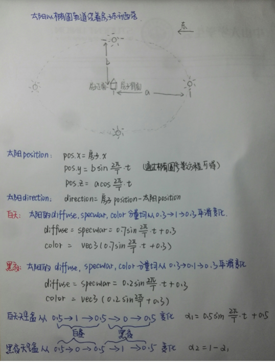
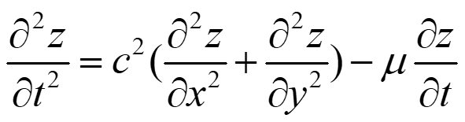
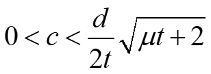
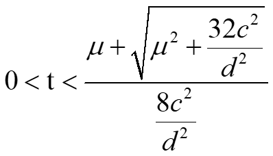
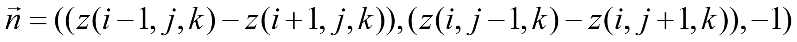
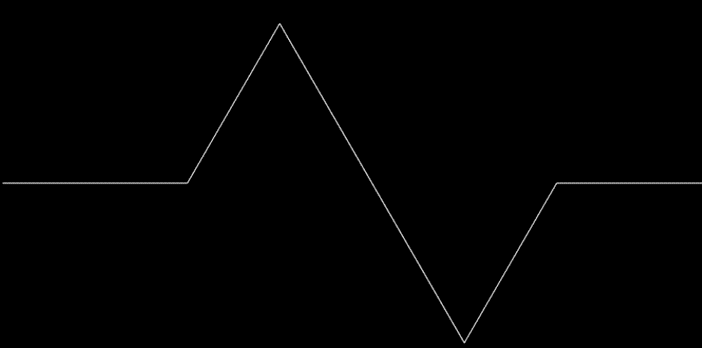
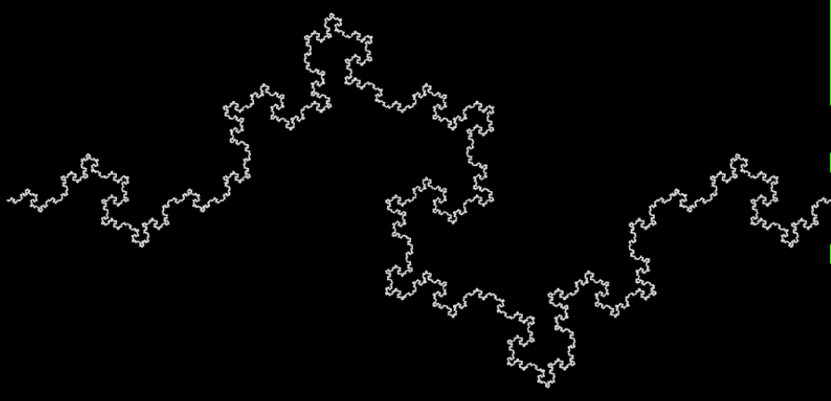

# Report 第8小组

[MagicHouse](https://github.com/HinanawiTenshi/magic-house)是一个基于OpenGL的功能性场景，全部由OpenGL代码编写而成，运用了多种计算机图形学技术。您所看到的天空，是一个3D材质天空盒；您所看到的房屋，是基于[Assimp](http://assimp.org/)导入的模型；您所看到的水面和波浪，是基于网格实现的流体模拟……总而言之，MagicHouse致力于展现尽可能丰富的计算机图形学内容。

## 一些截图

下方是一些成品截图，本项目的视频演示您可以在同一目录下找到。

## 开发环境

MagicHouse是基于C++开发的本地程序，通过[GLFW](http://www.glfw.org/)和[GLAD](http://glad.dav1d.de/)的适配，只须简单配置即可实现多操作系统下的开发与运行。下面是开发过程中使用到的所有库。

- [**GLFW**](http://www.glfw.org) OpenGL跨平台环境。
- [**GLAD**](http://glad.dav1d.de)
- [**GLM**](https://glm.g-truc.net/) OpenGL Mathematics。
- [**Assimp**](http://assimp.org/) 模型倒入库。
- [**freetype**](https://www.freetype.org/) 字体库。
- [**Imgui**](https://github.com/ocornut/imgui) 简单易用的图形界面工具。

## 实现功能

### Basic

- [Camera Roaming](#camera-roaming)
- [Simple Lighting and Shading(Phong)](#simple-lighting-and-shading)
- [Texture Mapping](#texture-mapping)
- [Shadow Mapping](#shadow-mapping)
- [Model Import and Mesh Viewing](#model-import-and-mesh-viewing)

### Bonus

- [Sky Box](#sky-box)
- [Complex Lighting](#complex-lighting)
- [Display Text](#display-text)
- [Gravity System](#gravity-system)
- [Collision Detection](#collision-detection)
- [Particle System](#particle-system)
- [Anti-Aliasing](#anti-aliasing)
- [Fluid Simulation](#fluid-simulation)

### [Camera Roaming](#实现功能)

摄像机的各种功能主要依赖于摄像机类`Camera`完成。在适当的地方修改摄像机对象的属性，并在渲染的时候实用由摄像机对象导出的`projection`和`view`矩阵，以实现摄像机的各种效果。例如，您可以通过WASD四个按键在平地上自由移动，这得益于处理输入函数能够修改摄像机对象的位置属性，而所有物体渲染所需要的`view`矩阵由同一个摄像机对象所导出。

### [Simple Lighting and Shading](#实现功能)

#### 光源

光源可选择点光源或平行光源，在Light类中进行配置。
在mesh.fs中创建了一个光照属性结构体，mesh.fs是用于渲染所有光照物体的片段着色器。

```c
struct Light {
    vec3 position;
    vec3 direction;
    vec3 ambient;
    vec3 diffuse;
    vec3 specular;
};

uniform Light light;
```
将Ligth类和光照属性结构体均独立出来可以便于添加不同光源，便于修改不同光属性，以及便于实现昼夜变换，随着全局时间变换太阳光方向等模拟真实太阳升起落下等等。
目前场景仅一个太阳光源为平行光。

#### 物体材质

不同物体受光材质不同，其漫反射，环境反射和镜面反射度均可能不相同，同一物体不同部分的受光材质也可能不同，一个物体具有漫反射贴图、镜面贴图和反光度贴图三种贴图，我们通过固定材质单元槽位的方式绑定相应的贴图。

```c
uniform sampler2D texture0;  // diffuse
uniform sampler2D texture1;  // specular
uniform sampler2D texture2;  // shininess
```

而不同物体可以赋予不同的贴图从而达到不同的光照效果。

#### Phong光照模型

当前使用Phong光照模型和冯氏着色Phong Shading。详细的代码可以参看项目的`mesh.fs`片段着色器文件。

### [Texture Mapping](#实现功能)

材质渲染的通用方式是类`Texture`和类`Renderer`及其子类的联合，一个`Texture`实例负责一个OpenGL材质的完整生命周期，而一个`Renderer`实例会在绘制前应用自己的所有材质。

对于材质管理，我们采用约定俗成的编号管理方式。在最主要的片段着色器`mesh.fs`中您可以看到4个材质单元，我们的约定如下，

```c
uniform sampler2D texture0;  // diffuse
uniform sampler2D texture1;  // specular
uniform sampler2D texture2;  // shininess
uniform sampler2D texture3;  // depth
```

即0号材质单元永远存放漫反射贴图；1号单元永远存放镜面反射贴图等，依此类推。若后来有新的材质需求，直接新增材质单元即可。

### [Shadow Mapping](#实现功能)

#### 阴影实现
阴影映射的实现方法与课堂上教的方式一样，首先把空间转换到光源空间中，然后对场景中所有物品进行深度计算，将深度放到帧缓冲中，根据深度来判断物品是否在阴影中，然后判断是否要进行阴影贴图。

#### 阴影改进
- 为了处理阴影失真(Shadow Acne)的现象，我们引入了阴影偏移（shadow bias）的技巧来解决这些问题。  
- 为了处理做悬浮(Peter Panning)的现象，我们使用了正面剔除（front face culling）的方法来解决这些问题。  
- 为了解决阴影的锯齿失真，我们使用了PCF。
做完了以上的优化之后，我们得到我们的阴影渲染。  

```c++
    vec3 projCoords = fragPosLightSpace.xyz / fragPosLightSpace.w;
    projCoords = projCoords * 0.5 + 0.5;
    float closestDepth = texture(texture3, projCoords.xy).r; 
    float currentDepth = projCoords.z;
    float bias = .0005f;
    float shadow = 0.0;
    vec2 texelSize = 1.0 / textureSize(texture3, 0);
    for(int x = -1; x <= 1; ++x)
    {
        for(int y = -1; y <= 1; ++y)
        {
            float pcfDepth = texture(texture3, projCoords.xy + vec2(x, y) * texelSize).r; 
            shadow += currentDepth - bias > pcfDepth ? 1.0 : 0.0;        
        }    
    }
    shadow /= 9.0;
```

### [Model Import and Mesh Viewing](#实现功能)

模型导入基于Assimp实现，模型类`Model`会为模型中的每一个网格生成对应的网格渲染器`MeshRenderer`对象，并在绘制时循环调用每个实例的绘制函数。我们认为，任何比正方体复杂的图元都应当使用网格和导入的方式完成渲染。场景中的房屋、栅栏、树、青蛙都是导入模型，在这里特别鸣谢在互联网免费发布这些模型的制作者们。

### [Sky Box](#实现功能)

天空盒的实现主要基于纹理贴图中的立方体贴图技术。对于立方体贴图，其实就是将多个2D纹理组合起来映射到一张纹理的一种纹理类型。基本流程如下：

```c++
unsigned int textureID;
glGenTextures(1, &textureID);
glBindTexture(GL_TEXTURE_CUBE_MAP, textureID);
```
立方体有6个纹理，需要调用glTexImage2D函数6次。
```c++
int width, height, nrChannels;
unsigned char *data;  
for(unsigned int i = 0; i < textures_faces.size(); i++)
{
    data = stbi_load(textures_faces[i].c_str(), &width, &height, &nrChannels, 0);
    glTexImage2D(
        GL_TEXTURE_CUBE_MAP_POSITIVE_X + i, 
        0, GL_RGB, width, height, 0, GL_RGB, GL_UNSIGNED_BYTE, data
    );
}
```
对应的，在片段着色器中，需要用到samplerCube，利用texture函数进行采样。
```c++
in vec3 textureDir; // 代表3D纹理坐标的方向向量
uniform samplerCube cubemap; // 立方体贴图的纹理采样器

void main()
{             
    FragColor = texture(cubemap, textureDir);
}
```
对立方体贴图设置加载完毕后，只需在渲染循环中将天空盒渲染即可
### [Complex Lighting](#实现功能)

#### 昼夜变化

昼夜变化主要包括一下内容： 
- 太阳位置按照椭圆轨迹变化以及其他属性相应的变化（position,direction,ambient,diffuse,specular） 
- 导入了一个夜晚天空盒，天空盒使用两个进行平滑切换，通过alpha进行控制 
- 这些alpha,光照分量等等都是时间t的三角函数。通过确定这些不同量的变化区间（最大和最小值）以及变化趋势，计算得到关于时间t的三角函数。这些变化都是通过经验以及多次尝试筛选出的最好的效果。



#### 伽马矫正

由于显示器有一个物理特性就是两倍的输入电压产生的不是两倍的亮度。输入电压产生约为输入电压的2.2次幂的亮度，所以实际显示出来的总会比预期暗，所以我们便会对偏暗的显示效果做到矫正。


如上图，显示器显示出来的亮度即下面这条曲线显示出来的比较暗的效果。于是我们就通过在最终颜色输出上应用监视器Gamma的倒数从而将颜色翻转到线性的颜色。

```c
fragColor.rgb = pow(fragColor.rgb, vec3(1.0/gamma));
```

将fragColor的每个颜色元素应用有一个1.0/gamma的幂运算。
但是由于纹理的创建大多数是在sRGB空间创建的，当我们基于监视器上看到的情况创建一个图像，我们就已经对颜色值进行了gamma校正，而最后渲染中又进行了一次gamma矫正，因此我们进行了两次gamma矫正，图片会出现太亮的情况，导致我们夜晚天空看起来都像是红色的。

因此我们就通过重校，把这些sRGB纹理在进行任何颜色值的计算前变回线性空间：

```c
glTexImage2D(GL_TEXTURE_2D, 0, GL_SRGB, width, height, 0, GL_RGB, GL_UNSIGNED_BYTE, image);
```

如上，如果我们在OpenGL中创建了一个纹理，把它指定为以上两种sRGB纹理格式其中之一，OpenGL将自动把颜色校正到线性空间中，这样我们所使用的所有颜色值都是在线性空间中的了。
但并非所有的纹理都是在sRGB空间的，我们仅仅对diffuse贴图进行重校。

#### HDR

HDR(High Dynamic Range,高动态范围)是一种图像后处理技术，是一种表达超过了显示器所能表现的亮度范围的图像映射技术。高动态范围技术能够很好地再现现实生活中丰富的亮度级别，产生逼真的效果。通常，显示器能够显示R、G、B分量在[0,255]之间的像素值。而256个不同的亮度级别显然不能表示自然界中光线的亮度情况。比如，太阳的亮度可能是一个白炽灯亮度的几千倍，是一个被白炽灯照亮的桌面的亮度的几十万倍，这远远超出了显示器的亮度表示能力。如何在有限的亮度范围内显示如此宽广的亮度范围，正是HDR技术所要解决的问题。

重点在于：曝光控制，即将高动态范围的图像映射到一个固定的低范围中，既屏幕能够显示的(0,1)的范围内。

1. 我们创建一个与屏幕宽高相同的浮点帧缓冲，浮点帧缓冲可以存储超过0.0到1.0范围的浮点值，而标准的帧缓冲会在将颜色值存入帧缓冲前自动将其约束到0.0到1.0之间。
2. 得到浮点颜色缓冲的帧缓冲，我们就会渲染场景到这个帧缓冲中，之后就再在一个铺屏四边形上应用这个帧缓冲的颜色缓冲。
3. 在渲染最终拥有浮点颜色缓冲纹理的2D四边形中的色调映射是HDR的一个重要步骤，我们来定义一个简单的直通片段着色器(Pass-through Fragment Shader)进行渲染。在其中要使用到色调映射。

色调映射(Tone Mapping)是一个损失很小的转换浮点颜色值至我们所需的LDR[0.0, 1.0]范围内的过程，我们使用的是Reinhard色调映射，它涉及到分散整个HDR颜色值到LDR颜色值上，所有的值都有对应。Reinhard色调映射算法平均得将所有亮度值分散到LDR上。我们将Reinhard色调映射应用到直通片段着色器上。

有了Reinhard色调映射的应用，我们不再会在场景明亮的地方损失细节。

同时我们可以通过调节曝光参数从而实现不同光照条件下的不同曝光等级，在日夜交替中，我们会在白天使用低曝光，在夜间使用高曝光，就像人眼调节方式一样。

高曝光值会使隧道的黑暗部分显示更多的细节，然而低曝光值会显著减少黑暗区域的细节，但允许我们看到更多明亮区域的细节。

若不使用色调映射，而是直接采样浮点颜色缓冲并将其作为片段着色器的输出。则这个2D四边形的输出是被直接渲染到默认的帧缓冲中，导致所有片段着色器的输出值被约束在0.0到1.0间，尽管我们已经有了一些存在浮点颜色纹理的值超过了1.0。这就像我们根本就没有应用HDR一样。

### [Display Text](#实现功能)

文字渲染功能，我们利用的是基于纹理的渲染。就是将一张字体库的纹理，根据所需将对应的字体截取下来，然后显示即可，基本流程如下：

#### 纹理
这里的纹理由CBFG生成，这是一种字体生成纹理的工具。

#### 绘制
对于绘制，就是生成一个矩形纹理，然后正确计算出该矩形的屏幕位置和纹理坐标，对应截取并显示，就想从报纸上剪纸一样。计算矩形截取的正确位置如下：
```c++
for ( unsigned int i=0 ; i<length ; i++ ){

    glm::vec2 vertex_up_left    = glm::vec2( x+i*size     , y+size );
    glm::vec2 vertex_up_right   = glm::vec2( x+i*size+size, y+size );
    glm::vec2 vertex_down_right = glm::vec2( x+i*size+size, y      );
    glm::vec2 vertex_down_left  = glm::vec2( x+i*size     , y      );

    vertices.push_back(vertex_up_left   );
    vertices.push_back(vertex_down_left );
    vertices.push_back(vertex_up_right  );

    vertices.push_back(vertex_down_right);
    vertices.push_back(vertex_up_right);
    vertices.push_back(vertex_down_left);
}
```
然后，设置好显示的屏幕位置后，就可以传入片段着色器进行显示
```c++
void main(){
    color = texture( myTextureSampler, UV );
}
```
### [Gravity System](#实现功能)

重力系统本质是物体的移动，只要通过速度公式计算出物体的位置，即可模拟重力系统。在MagicHouse的粒子系统中实现了简单的重力系统，可以给粒子一个特定方向的加速度。

计算公式利用牛顿第二定律，在每一帧以粒子生命为时间，计算粒子的位移，即可得到粒子经过运动后在这一帧的位置。

### [Collision Detection](#实现功能)

碰撞检测是计算机图形学的一个难题，方法有很多。碰撞检测器类`CollisionDetector`以立方体的形式储存了一系列碰撞体积，运动的对象可以在渲染前请检测器对象帮忙检查自身在这一帧是否发生碰撞。MagicHouse中我们仅对摄像机进行了碰撞检测，玩家不可以穿透场地上的各个物体。

### [Particle System](#实现功能)

粒子系统是绘制无规则外形物体的利器，由WILLIAM T. REEVES于1983年首次提出，我们详细阅读了该论文，按照论文里的思路实现了粒子渲染器类`ParticleRenderer`。

按照论文的描述，一个粒子发生器至少包括以下属性，

- 粒子数目
- 初始位置
- 初始速度（包括大小和方向）
- 初始大小
- 初始颜色
- 初始形状
- 初始生命值

在此基础上，还可以增加各种物理成分，例如重力、风等等。

粒子系统最重要随机特性体现在，每一个属性都由平均值和波动范围组成，在生成例子时，所有属性都由平均值加上一个随机的偏差值得到，这种随机机制决定了粒子系统的强大。

MagicHouse中，通过拉大初始位置的波动范围，能够让粒子在以初始位置的平均值为中心的一个立方体范围中随机产生，再控制其运动速率和方向，模拟出了下雪的效果。

### [Anti-Aliasing](#实现功能)

假如我们只使用在课堂上学的知识进行渲染的时候，会发生走样，也就是产生锯齿边缘，这些锯齿边缘的产生和光栅器将顶点数据转化为片段的方式有关。为了缓解这些现象，我们引入了反走样的技术来帮助我们缓解这种现象，从而产生更平滑的边缘。  
我们使用多重采样抗锯齿(Multisample Anti-aliasing, MSAA)这项技术来进行反走样。  
我们一开始使用光栅器进行渲染的时候，对于每个像素的中心只有一个采样点，它会被用来决定这个三角形是否遮盖了某个像素。图中红色的采样点被三角形所遮盖，在每一个遮住的像素处都会生成一个片段。虽然三角形边缘的一些部分也遮住了某些屏幕像素，但是这些像素的采样点并没有被三角形内部所遮盖，所以它们不会受到片段着色器的影响。但这样会导致走样。
如图：  

  
这个就是锯齿产生的原因，为了减缓这种现象，我们可以对一个像素设置多个取样点，对于三角形的内部的像素，片段着色器只会运行一次，颜色输出会被存储到全部的4个子样本中。而在三角形的边缘，并不是所有的子采样点都被遮盖，所以片段着色器的结果将只会储存到部分的子样本中。根据被遮盖的子样本的数量，最终的像素颜色将由三角形的颜色与其它子样本中所储存的颜色来决定。  

  
这就是MSAA的操作原理，我们可以看出，引入可多采样技术之后，锯齿效应减缓了许多。  
但相对的，这种方式会使得内存占用会更加的多。

### [Fluid Simulation](#实现功能)

河流模拟由河岸生成和流体模拟组合而成。
#### 流体模拟
水波运动的位移(z)满足偏微分方程：
  
（其中， c是波速， μ是描述阻力大小的系数， x， y， z是空间坐标， t是时间间隔 z(i, j, k)的含义为在平面位置(i,j)第k个间隔时间的高度。
）  
然后我们使用有限差分法来解这个偏微分方程（不用龙格库塔和欧拉法的原因是，这两种方法一般用来解常微分方程的，偏微分方程一般使用有限差分法）
  
如果波动速率c太快，或者时间间隔t太长，那么我们的迭代方程将会发散到无穷。为了保证位移是有限的，我们需要决定一个确切的坐标值，使得方程在这个值之下保持稳定。为了保证收敛，我们要求从水平表面离开的顶点应当沿着释放时的表面移动，根据以上条件，我们可以计算出方程的收敛条件为：

  
计算出贴图坐标之后就好进行渲染了，为了反射光线，我们还需要计算其法向量，也是用一样的方式计算。
  

#### 河岸模拟
对于河岸，我们使用的是Koch分型来生成，以一种迭代的方式来生成河岸。  
迭代方式：  
 
迭代6次以后的样子：  
 

## 遇到的问题和解决方案

1. 不一定所有的物体都含有漫反射贴图、镜面贴图和反光度贴图这三种贴图，这个要看找的模型中自带什么贴图，因此我们通过固定材质单元槽位的方式绑定相应的贴图，如果没有则直接赋一个初始值。

2. 在Gamma矫正时，发现Gamma矫正后，整体场景颜色特别亮，有种泛白的感觉，夜晚的天空也有种红色的感觉，后面查资料发现由于纹理的创建大多数是在sRGB空间创建的，当我们基于监视器上看到的情况创建一个图像，我们就已经对颜色值进行了gamma校正，而最后渲染中又进行了一次gamma矫正，因此我们进行了两次gamma矫正，图片会出现太亮的情况。因此我们就通过重校，把这些sRGB纹理在进行任何颜色值的计算前变回线性空间，从而解决了这个问题（具体在Gamma矫正介绍那里也有提到）。

## 小组成员分工

### 玮(15331389)

- 项目框架搭建
- 面向对象设计
- Model Import and Mesh Viewing
- Gravity System and Collision Detection
- Particle System
- 报告撰写

### 蓓(15331324)

- Simple Lighting and Shading(Phong)
- Complex Lighting
- 实现昼夜变化效果，搜索夜晚天空盒材质
- 搜索并导入了模型树、栅栏
- report上述实现功能的部分
- 制作了期末展示PPT

### 侨(15331390)

- 文字渲染
- 天空盒
- 导入模型青蛙
- 添加时间控制功能

### 良(15331385)

- Shadow
- 阴影优化
- Fluid Simulation
- Anti-Aliasing
- 期中展示
- 期末展示

### 飞()

- 导入合适数量模型
